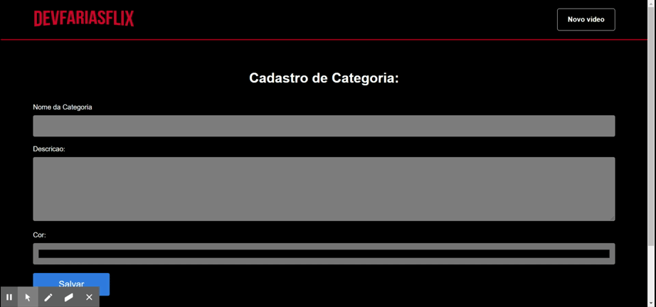

## Projeto Desenvolvido Durante a Semana da Imersão Alura React

-- O projeto trata-se de um clone da netflix, de forma que apresente conteúdos de gosto pessoal;

### Instalando o projeto 

Para usar o projeto basta apenas rodar o comando npm install, para que seja possível instalar as dependências.
O mesmo se encontra em verão de produção em deploy na vercel.com.

https://devfariasflix.vercel.app/
